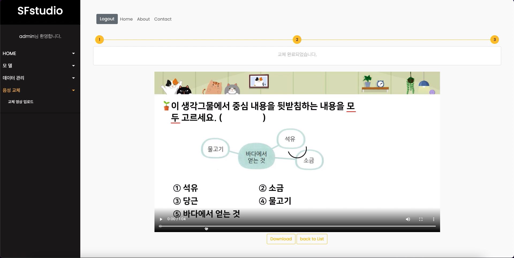
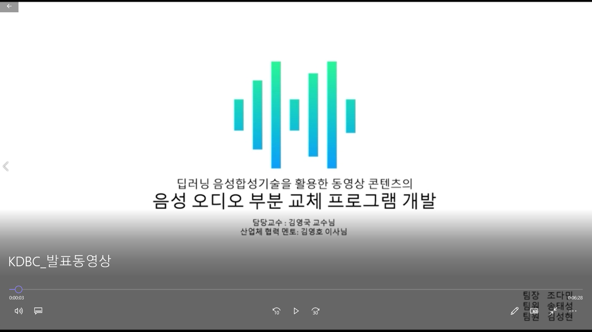

# VoiceReplacementProgram
Development of a voice audio replacement program for video content using deep learning speech synthesize technology
 
<pre>
This Project is Industry-academic cooperation(<a href="http://www.mayfarm.co.kr/">MayFarm</a>).
중요한 소스코드는 삭제했습니다.
</pre>

## Information
교육 동영상 시장이 확대되면서 성우를 기용해 제작된 영상들 또한 늘고 있는 실정이다. 이렇게 제작된 영상의 경우 추후 수정 작업이 생길 때 해당 영상을 녹음한 성우를 재섭외하여 다시 녹음해야 한다는 불 편함이 생기는데 이는 교육 동영상 제작 업체에게 시간적, 금전적으로 부담이 될 수 있다. 이러한 문제를 해결하기 위해 딥러닝 음성 합성 모델인 Tacotron2를 통해 한국어 기반 음성 합성을 할 수 있다. 이러한 음성 합성 기술을 사용하여 사용자는 동영상의 특정 성우의 목소리를 저장하고 학습용 데이터로 가공할 수 있다. 이렇게 학습한 음성 합성 모델을 사용해서 성우의 목소리와 유사한 음성을 합성할 수 있다. 우리 는 만들어진 음성을 가지고 영상의 부분 음성 교체를 진행하며 수정한 영상을 설문자에게 의뢰한 결과 5 점 만점에서 4.77점을 기록했다. 이를 활용하여 우리는 학습용 교육 동영상을 제작하는 과정에서 발생하 는 비용의 비효율성을 개선할 수 있을 것이라고 기대한다.

# Demo

    

# Presentation

     
    
      
    <a href="https://dbsociety.kr/kdbc/kdbc2021/program.html" target="_blank">KDBC 2021</a>

## Reference
> Speech Synthesize Model
> - <a href="https://arxiv.org/abs/1712.05884" target="_blank">Tacotron2</a>
> - <a href="https://github.com/hccho2/Tacotron2-Wavenet-Korean-TTS" target="_black">GitHub</a>

> Libraries 
> - <a href="https://github.com/jiaaro/pydub" target="_blank">Pydub</a> 
> - <a href="https://github.com/Zulko/moviepy" target="_blank">MoviePy</a>
> - <a href="https://www.tensorflow.org/" target="_blank">Tensorflow</a>

> Datasets 
> - <a href="https://www.kaggle.com/bryanpark/korean-single-speaker-speech-dataset" target="_blank">KSS DataSets</a>

### Develop Environment
1. Linux, MacOS(Big Sur, <code>Intel</code>)
2. Pycharm
3. Python
4. Django
5. MariaDB

### How to Start
conda activate <code>Your Environment</code> 
cd <code>Your Path</code> 
<pre>
python manage.py <code>YourIP:PORT</code>
</pre>

# Requirement
<pre>
<code>tensorflow-gpu == 1.8.0</code>
<code>cudatoolkit == 9.0</code>
<code>cudnn == 7.6.0</code>
<code>ffmpeg == 4.0</code>
<code>pydub == 0.25.1</code>
<code>moviepy == 1.0.3</code>
<code>jamo == 0.4.1</code>
</pre>